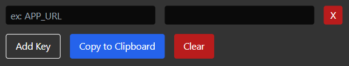

# ENV Manager



This project allows to edit environment (.env) files for projects, add items and copy them when needed.

## Usage

1. Clone your project:

```
git clone https://github.com/furkancansimsek/EnvManager
cd EnvManager
```

2. Install the project dependencies:

```
npm install
```

3. Run the project files:

```
npm run dev
```

## Features

- **ENV File Editing**: You can edit the `.env` file by copying and pasting it into input in this project.
- **Adding Items**: You can add new items and set their values.
- **Copy File**: You can copy the edited `.env` content.

## Development

Follow the steps below for the development of the project:

1. Switch to the development branch:

```
git checkout development
```

2. Add new features or fix bugs.

3. Make your changes and submit a pull request.

## Contributing

If you want to contribute to this project, please submit a merge request. You can contribute to add new features, fix bugs or improve the documentation.